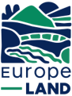
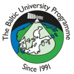
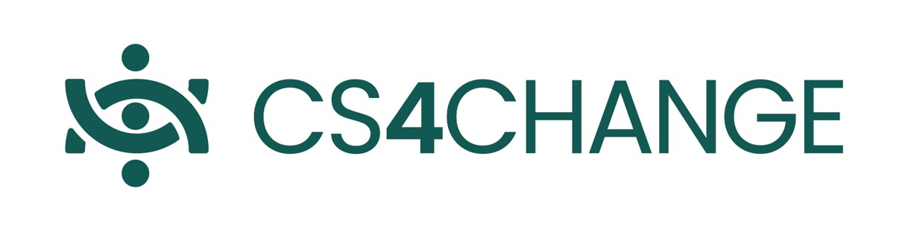

# Wetland Mapping

A remote sensing and machine learning framework for wetland vegetation mapping using UAV imagery and Sentinel-2.

<p align="center">
  
  &nbsp;&nbsp;&nbsp;
  
  &nbsp;&nbsp;&nbsp;
  
  &nbsp;&nbsp;&nbsp;
  
</p>
<p align="center">
  
</p>

ACT! Summer School 2026

This project was developed as part of the ACT! Summer School Series: Observation, Modelling and Acting for Sustainable Land-Use in the Context of Climate Change and Biodiversity, held at the Estonian University of Life Sciences in Tartu, Estonia, 10–17 August 2026.

The summer school was organized within the framework of the Europe-LAND and SUNRISE projects, with support from The Baltic University Programme (BUP).

## Overview

This repository contains the code and workflows developed for mapping and characterizing wetland vegetation using satellite and UAV remote sensing data. The workflow integrates vegetation and spectral indices, geospatial processing, machine learning clustering, and comparison between Sentinel-2 and high-resolution UAV observations.

## Project Structure

```text

├── notebooks/
│   ├── 01_calculate_rs_indices.ipynb
│   ├── 02_create_dataset.ipynb
│   ├── 03_run_clustering.ipynb
│   ├── 04_interpretation.ipynb
│   ├── 05_compare_drone-sentinel_imageries.ipynb
│   └── _visualization.ipynb
│
├── results/                     # Generated outputs and figures
│
├── src/
│   ├── geospatial.py            # Geospatial processing utilities
│   ├── modelling.py             # Modelling and clustering functions
│   ├── plots.py                 # Visualization functions
│   ├── vegetation_indices.py    # Remote sensing vegetation indices
│   └── workflow.py              # Workflow utilities
│
├── .gitignore
├── README.md
└── main.py
```

## Workflow

The main analysis consists of:

1. Calculation of remote sensing and vegetation indices.
2. Creation of the analysis dataset.
3. Clustering of wetland vegetation characteristics.
4. Interpretation of the resulting clusters.
5. Comparison of Sentinel-2 observations with UAV imagery.

## Data

The project uses remote sensing and geospatial datasets, including Sentinel-2 imagery and UAV observations.

## Requirements

The workflow is implemented in Python. Main dependencies include packages for:

* geospatial data processing
* raster and vector analysis
* numerical and tabular data processing
* machine learning
* visualization

## Authors

- Konstantinos Plataridis - [@KonstantinosPl](https://github.com/KonstantinosPl) - Aristotle University of Thessaloniki / Department of Civil Engineering
- Poppy Ferguson - University of Strathclyde / Electronic and Electrical Engineering
- Riccardo Martinez - [@MrKri03](https://github.com/MrKri03) - EMU University / Landscape Management and Environmental Protection  
- David Strifler - Kiel University / Department of Environmental and Energy Economics
